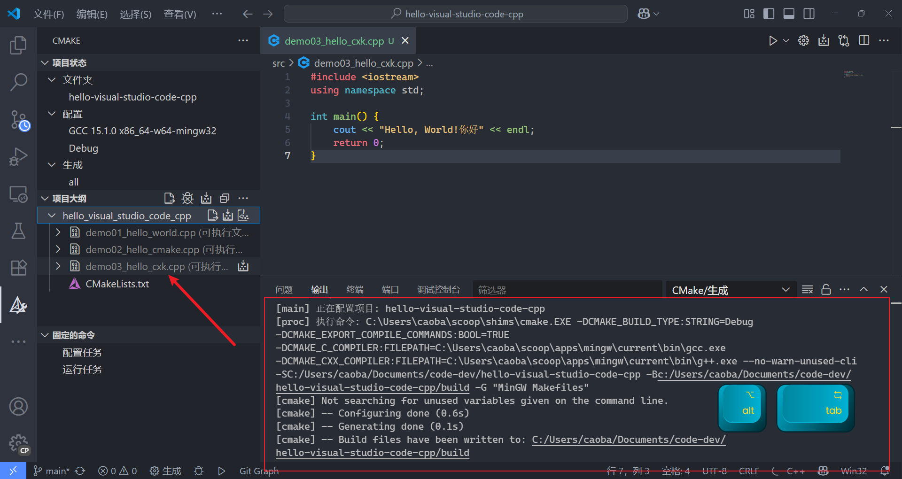
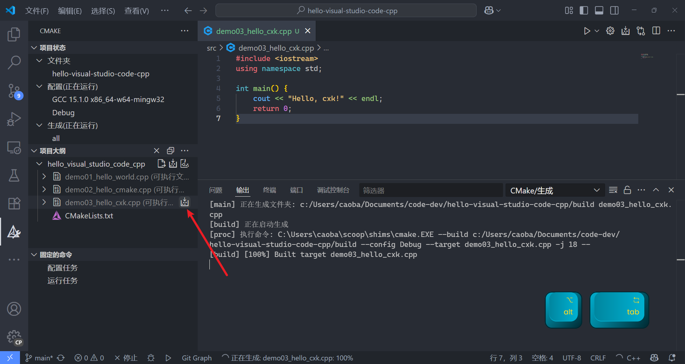

# How to

WHAT !? | WHY | HOW

## How to 创建新的 vsc 配置


## How to 创建新的 cpp 文件

1. 新建文件 `demo03_hello_cxk.cpp`


2. 通过 CMake 生成配置




3. 编写代码

```cpp
#include <iostream>
using namespace std;

int main() {
    cout << "Hello, cxk!" << endl;
    return 0;
} 
```

4. 运行

[参见 How to 生成 exe](#How to 生成 exe)

## How to 生成 exe




## How to 重新配置 cpp 拓展

> [!TIP]
>
> 重新配置后 请清理并重新配置生成项目


## How to 控制台中文乱码问题

ummm 还是尽量 英格力士 吧，网上搜了很多解决方案都不怎么好..........