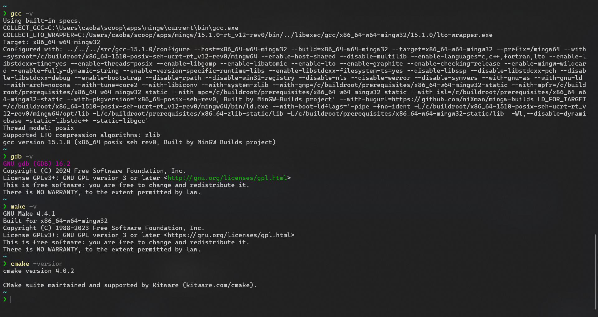

# 前置条件

umm....................................

## pwsh

- [pwsh 7.5.1](https://github.com/PowerShell/PowerShell/releases/tag/v7.5.1)


umm 下载好后直接运行 (无视风险继续安装! 😛)


## scoop

- https://scoop.sh/


1. 打开 pwsh 并执行

```shell
Set-ExecutionPolicy -ExecutionPolicy RemoteSigned -Scope CurrentUser
Invoke-RestMethod -Uri https://get.scoop.sh | Invoke-Expression
```

2. check

```shell
scoop --help
```


到此我们的 scoop 算是安装好了

# install

scoop 安装软件

> [!TIP]
>
> 我们可以通过 https://scoop.sh/#/apps 中搜索我们需要的软件然后通过 `scoop install xxx ` 进行安装 需要注意的是在通过
> scoop 安装软件的时候我们也还是需要甄别一下软件的来源(一般选择官方认证过的，更新时间较近的 较好)

scoop 安装 vsc


```shell
scoop bucket add extras
scoop install extras/vscode
```

scoop 安装 mingw


```shell
scoop bucket add main
scoop install main/mingw
```

scoop 安装 cmake

由于 mingw 并不带有 cmake(默认 make,gcc,gdb,g++) 因此我们单独安装


```shell 
scoop bucket add main
scoop install main/cmake
```

验证

- 我们可以通过 `scoop list` 查看已安装的软件


对于需要安装为命令的工具可以通过

```shell
gcc -v
gdb -v
make -v
cmake -version
```



我们还可以通过 scoop 提供的 `which` 命令查找已安装的命令

> which Locate a shim/executable (similar to 'which' on Linux)

```shell
scoop which gcc
scoop which java
scoop which cmake
```


# 配置 vsc

> [!TIP]
>
> **此部分操作内容太多，文档表现太局限，因此以视频内容为主**

通过上面的步骤我们已经安装好了 scoop 和 pwsh 并通过 scoop 安装了

- mingw(gcc,g++,gdb,make)
- visual studio code
- cmake

## 插件安装

我们通过`.vscode/extensions.json` 的方式进行插件的安装 这样当项目被打开时，VS Code 会检测此文件并提示安装推荐的扩展。

> [!TIP]
>
> 如果需要汉化请将 ` // "MS-CEINTL.vscode-language-pack-zh-hans",` 的注释去掉

```json
{
  "recommendations": [
    // "MS-CEINTL.vscode-language-pack-zh-hans", // 中文语言包
    "atommaterial.a-file-icon-vscode",
    // 文件图标主题
    // 版本控制相关
    "mhutchie.git-graph",
    // 可视化 git 分支图
    "redjue.git-commit-plugin",
    // git 提交信息辅助工具（含规范化提示）
    // 代码标记与笔记工具
    "wayou.vscode-todo-highlight",
    // TODO 注释高亮显示
    "yzhang.markdown-all-in-one",
    // Markdown 全功能支持
    // C++ 核心开发工具链
    "ms-vscode.cpptools",
    // 官方 C++ 扩展（提供 IntelliSense、调试等功能）
    "ms-vscode.cmake-tools",
    // CMake 集成支持
    "GitHub.copilot",
    // GitHub AI 编程助手
    // 远程开发支持
    "ms-vscode-remote.remote-ssh",
    // SSH 远程开发支持
    // 代码风格与格式化
    "EditorConfig.EditorConfig",
    // 多编辑器统一代码风格配置
    "LeetCode.vscode-leetcode",
    // LeetCode 刷题集成
    // 快捷键方案（针对从 IDEA 转来的开发者）
    "k--kato.intellij-idea-keybindings"
    // IntelliJ IDEA 快捷键映射
  ]
}
```

| 扩展 ID                               | 功能描述                             |
|:------------------------------------|:---------------------------------|
| `shaobeichen.gradient-theme`        | 提供舒适的渐变色主题，减少视觉疲劳                |
| `atommaterial.a-file-icon-vscode`   | 增强文件类型图标识别，支持600+文件类型            |
| `mhutchie.git-graph`                | 可视化 git 分支图谱，支持提交历史查看和分支操作       |
| `redjue.git-commit-plugin`          | 规范化 git 提交信息                     |
| `wayou.vscode-todo-highlight`       | 高亮显示 `TODO`/`FIXME `等注释标记        |
| `yzhang.markdown-all-in-one`        | Markdown 写作支持（目录生成、数学公式、自动补全等）   |
| `ms-vscode.cpptools`                | 提供 C++ 智能感知、调试和代码导航（**必需安装**）    |
| `ms-vscode.cmake-tools`             | CMake 项目支持（配置、构建和测试）             |
| `GitHub.copilot`                    | AI 代码补全建议（需 GitHub 账号）           |
| `ms-vscode-remote.remote-ssh`       | 通过SSH连接远程服务器开发                   |
| `EditorConfig.EditorConfig`         | 跨编辑器代码风格统一（需配合`.editorconfig`文件） |
| `LeetCode.vscode-leetcode`          | LeetCode 题库集成（刷题辅助工具）            |
| `k--kato.intellij-idea-keybindings` | 为 IntelliJ IDEA 用户提供熟悉的快捷键映射     |

## 编辑器配置

同理我们通过 `.vscode/settings.json` 文件对 vsc 编辑器进行配置

```json
{
  // 文件自动保存设置 - 当编辑器失去焦点时自动保存
  "files.autoSave": "onFocusChange",
  // 设置默认的代码格式化工具为 EditorConfig
  "editor.defaultFormatter": "EditorConfig.EditorConfig",
  // 在保存文件时自动格式化代码
  "editor.formatOnSave": true,
  // 禁用删除文件时的确认对话框
  "explorer.confirmDelete": false,
  // 编辑器字体设置
  "editor.fontFamily": "Cascadia Mono",
  // 使用 Cascadia Mono 字体
  "editor.fontSize": 12.6,
  // 字体大小设为12.6
  "editor.fontWeight": "normal",
  // 字体粗细为正常
  // 窗口缩放级别
  "window.zoomLevel": 1.5,
  // 光标设置
  "editor.cursorStyle": "line",
  // 光标样式为线型
  "editor.cursorBlinking": "expand",
  // 光标闪烁效果为扩展动画
  "editor.cursorWidth": 1,
  // 光标宽度为1像素
  "editor.cursorSmoothCaretAnimation": "on",
  // 启用平滑的光标动画
  // Markdown预览字体大小
  "markdown.preview.fontSize": 11,
  // 工作区主题设置
  "workbench.colorTheme": "One Monokai",
  // 使用 One Monokai 颜色主题
  "workbench.iconTheme": "a-file-icon-vscode",
  // 使用 a-file-icon-vscode 图标主题
  // Git提交插件设置 - 限制主题行最多30个字符
  "GitCommitPlugin.MaxSubjectCharacters": 30,
  // 启用文件嵌套功能（将相关文件分组显示）
  "explorer.fileNesting.enabled": true
}
```

## 配置 C/C++ Extension Pack

video

## CMakeLists.txt

```shell
cmake_minimum_required(VERSION 3.26)
project(hello_visual_studio_code_cpp C CXX)

# --------------------------< 使用须知 >------------------------------------
# 本文件是一个自动化的 CMakeList，有以下功能：
# - 自动遍历 src 目录下的所有 .c 和 .cpp 文件，并将其编译为可执行文件。
# - 将可执行文件(即编译结果)输出到项目根目录下的 .runtime/ 目录中。
# - 将库文件输出到项目根目录下的 .library/ 目录中。
# - 将中间文件输出到项目根目录下的 .archive/ 目录中。
# >-----------------------------------------------------------------------
# 使用此 CMakeList 时，若要新建 C/C++ 语言文件，请按照以下步骤：
# 1. 右键 src 目录(如果没有 src 目录，请先创建)——新建——C/C++源文件
# 2. 在弹出的对话框中，输入文件名(仅允许英文小写及下划线，不要出现空格)，
#    后缀为 ".c(C语言文件)"或".cpp(C++文件)"，切记不要勾选“添加到目标”，点击确定。
# 3. 点击 左上角横线——文件——重新加载 CMake 项目 。
# 注：未重载前，进入文件可能会有“不属于任何项目目标”的警告，重载后即会消失。
#    若此警告未消失，请检查文件是否在 src 目录下，以及文件名是否符合规范。
# >-----------------------------------------------------------------------
# 使用此CMakeList  时，若运行 main() 函数代码，请直接点击函数前的绿色三角形按钮。
# 右上角的运行按钮会自动运行最近一次运行的程序，因此可能不是你想要的结果。
# ------------------------------------------------------------------------

# 按照书本要求设定C语言和C++版本
set(CMAKE_C_STANDARD 99)
set(CMAKE_CXX_STANDARD 20)

# 设定构建运行路径，避免污染根目录
set(CMAKE_ARCHIVE_OUTPUT_DIRECTORY ${PROJECT_SOURCE_DIR}/.archive)
set(CMAKE_LIBRARY_OUTPUT_DIRECTORY ${PROJECT_SOURCE_DIR}/.library)
set(CMAKE_RUNTIME_OUTPUT_DIRECTORY ${PROJECT_SOURCE_DIR}/.runtime)
set(EXECUTABLE_OUTPUT_PATH ${PROJECT_SOURCE_DIR}/.runtime)
set(LIBRARY_OUTPUT_PATH ${PROJECT_SOURCE_DIR}/.library)

include_directories(${PROJECT_SOURCE_DIR}/src)

# 遍历项目src目录下所有的 .c 文件，自动添加
file(GLOB_RECURSE files src/*.c src/*.cpp)
foreach (file ${files}) # 遍历所有发现的文件
    get_filename_component(name ${file} NAME) # 获取文件名
    add_executable(${name} ${file}) # 添加可执行文件
endforeach () # 遍历结束
```

## Hello CPP

video

## Hello CMake

video

## 大体目录结构


```shell
hello-visual-studio-code-cpp/
├── 配置文件
│   ├── .editorconfig    # 跨编辑器代码风格配置
│   ├── .gitignore       # git 版本控制忽略规则
│   └── CMakeLists.txt   # CMake 构建系统配置文件（核心构建逻辑）
├── 文档
│   ├── INSTALL.md       # 项目安装说明
│   └── README.md        # 项目概览文档
├── 构建输出目录
│   ├── .archive/        # 中间文件（由 CMake 自动生成）
│   ├── .library/        # 库文件输出目录（由 CMake 自动生成）
│   └── .runtime/        # 可执行文件输出目录
├── VS Code 配置
│   └── .vscode/         # 工作区专属配置
│       ├── extensions.json # 推荐扩展列表
│       └── settings.json   # 编辑器设置
├── 静态资源
│   └── assets/          # 图片/字体等资源文件
├── 头文件
│   └── include/         # 公共头文件目录
│       └── hello_cpp.h  # 示例头文件
└── 源代码
    └── src/             # 主源代码目录
        ├── demo01_hello_world.cpp
        ├── demo02_hello_cmake.cpp 
        └── demo03_hello_cxk.cpp
```

# LeetCode 集成

**感觉不太好用**


# 云开发

TODO

## github

TODO

## devbox

TODO

# ref

- [How TO](HOW-TO.md)