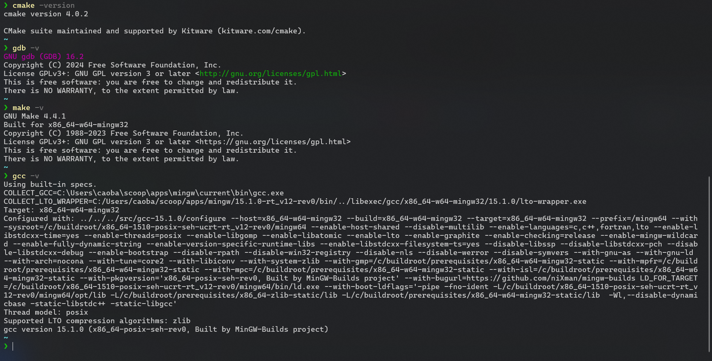
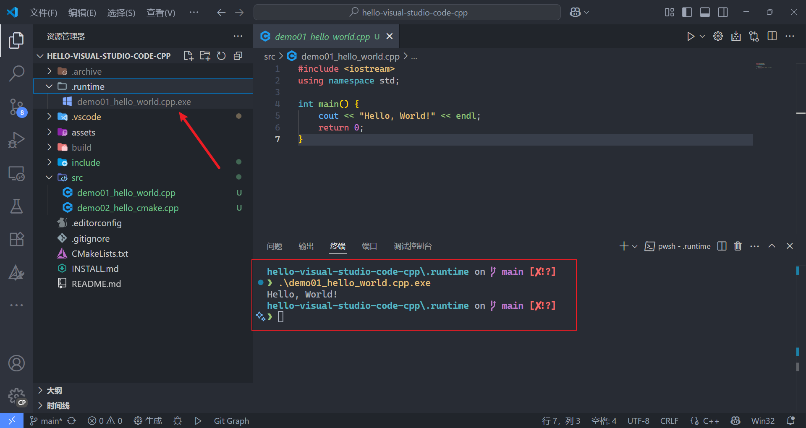
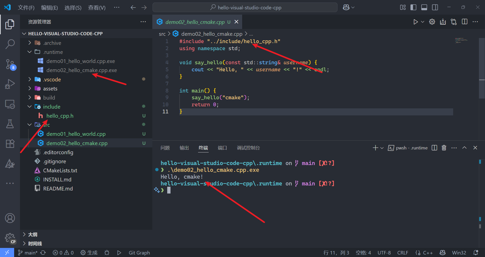
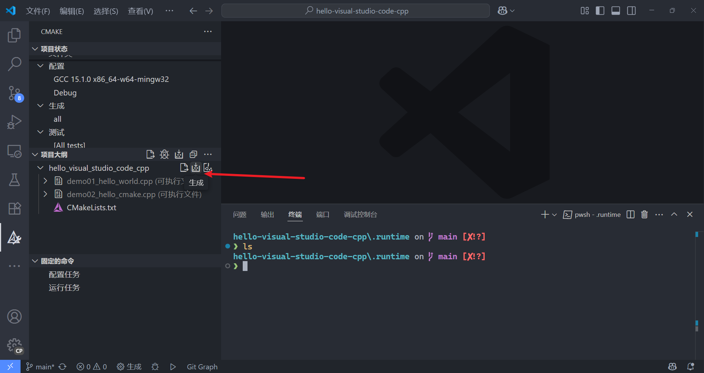
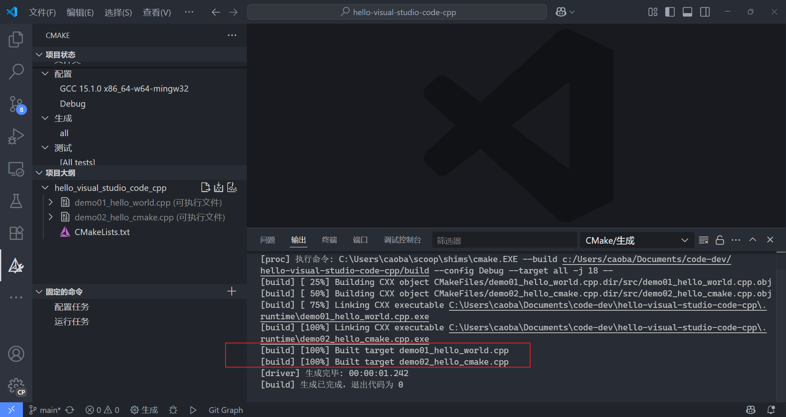
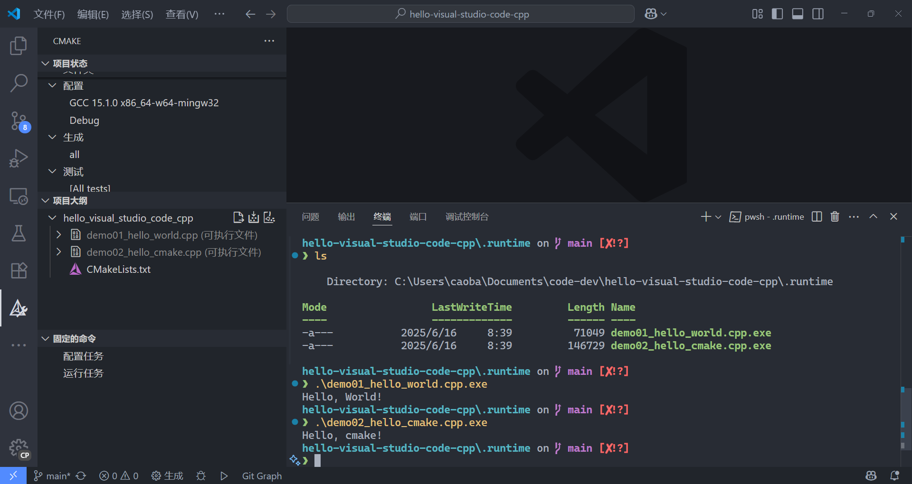
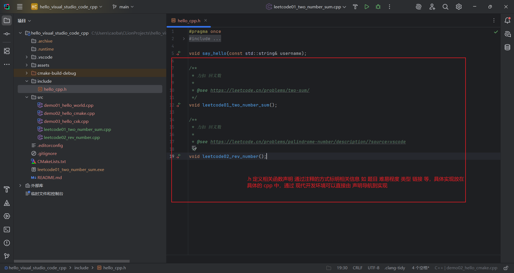
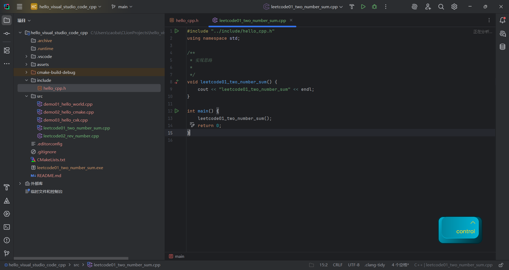

# visual-studio-code for cpp

> [!CAUTION]
>
> 项目基于 windows24H2 进行演示 但思路对其它系统具有参考意义(大差不差的)

该项目主要是为了记录 visual studio code 配置 cpp 环境,请注意:

- 项目的目的是出于学习数据结构
- 本人并不是专业的 cpp dev (因此可能存在配置上不规范的地方)
- 文档中涉及的资料都注明了相关出处(如有侵权 请联系删除)

---

项目优势(解决痛点)

- 支持多 main (便于 dev [切记避免引起歧义--- `c/cpp` 程序有且只有一个 `main`函数])
- 结构化(目录清晰 便于 ummm... 编不下去了)
- 依托于 vsc 的 `extensions.json,settings.json` 环境配置更统一(便于迁移)
- just so so ~

---

实现思路:

- 通过 scoop 安装相关软件及依赖如(vsc,mingw 等)
- 通过 vsc 的 `extensions.json,settings.json` 环境管理
- 通过 cmake 进行 cpp 项目的构建和编译

---

版本信息(mingw 15.1.0-rt_v12-rev0)

| tools | version |
| ----- | ------- |
| gcc   | 15.1.0  |
| gdb   | 4.4.1   |
| make  | 16.2    |
| cmake | 4.0.2   |



# 功能演示

ummmmm 不知道说啥

## 编译不带头文件的 cpp

```cpp
#include <iostream>
using namespace std;

int main() {
    cout << "Hello, World!" << endl;
    return 0;
} 
```



## 带头文件的 cpp

```cpp
#include <iostream>
#include <string>

void say_hello(const std::string& username);
```

```cpp
#include "../include/hello_cpp.h"
using namespace std;

void say_hello(const std::string& username) {
    cout << "Hello, " << username << "!" << endl;
}

int main() {
    say_hello("cmake");
    return 0;
} 
```



## 多 cpp







## 优势

通过对 .h 文件以及多 mian/cpp 的支持可以实现





---

[INSTALL ](./INSTALL.md)

