# 前期准备

唉 ummmmm 还是不知道说啥

## install pwsh

PowerShell 是一种跨平台的任务自动化解决方案，由命令行 shell、脚本语言和配置管理框架组成。 PowerShell 在 Windows、Linux 和 macOS 上运行。

>  有关什么是 pwsh 此处仅作简要概述 详情可以参考[pwsh 概述](https://learn.microsoft.com/zh-cn/powershell/scripting/overview?view=powershell-7.5)

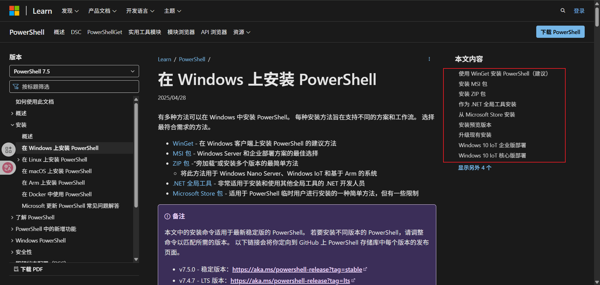

官网为我们提供了很多安装方式 此处我们选取 github.exe x64 安装

- https://github.com/PowerShell/PowerShell/releases/tag/v7.5.1


umm 下载好后直接运行 (无视风险继续安装! 😛)

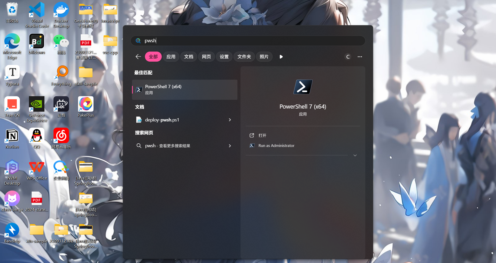


## install scoop

[scoop](https://scoop.sh/) is a command-line installer for Windows (umm 好吧 它就是个 windows 下的命令行安装工具)

没找到别的相关介绍，倒是在 知乎 找到一篇很好的贴子 https://zhuanlan.zhihu.com/p/463284082


> [!TIP]
>
> ummm 写的真好 🐂🍺

大概就是通过 scoop 我们可以通过命令行的方式安装软件（统一分发 避免全家桶 从我做起），这里简要概述下 我使用 scoop 的几点原因吧:

- 社区完善（毕竟 MS 出品)
- 支持 sdk 的多版本管理 (java、python etc..)
- umm 貌似没了(哦对了 scoop 好像支持依赖的自动解析 [一定程度上可以解决软件安装过程中环境之类的问题])
- **scoop 还支持 export | import 统一导出|入 妈妈再也不用担心新安装的系统还得从头一个一个安装软件了**
- 哦对了 scoop 还可以统一安装目录(虽然但是懒得折腾了 直接 C 盘！ ) 算了还是贴一下吧 (本人未实践过下面方式)


还有就是有关 CFW 的问题，umm github 上貌似有很多社区维护的 bucket (未实践操作，应该是可以的，更新频率挺频繁)

https://github.com/lzwme/scoop-proxy-cn


扯了这么多 开始安装 scoop 吧

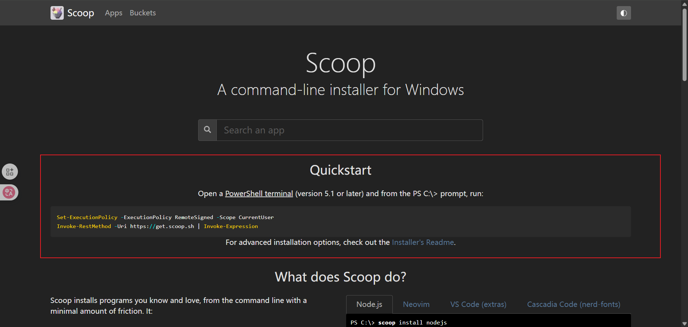

1. 打开 pwsh 并执行

```shell
Set-ExecutionPolicy -ExecutionPolicy RemoteSigned -Scope CurrentUser
Invoke-RestMethod -Uri https://get.scoop.sh | Invoke-Expression
```

上面的命令做了什么呢:

- `Set-ExecutionPolicy -ExecutionPolicy RemoteSigned -Scope CurrentUser` 大概就是授予相关策略
- `Invoke-RestMethod -Uri https://get.scoop.sh | Invoke-Expression` install

详情可以查看 https://learn.microsoft.com/zh-cn/powershell/module/microsoft.powershell.security/set-executionpolicy?view=powershell-7.5

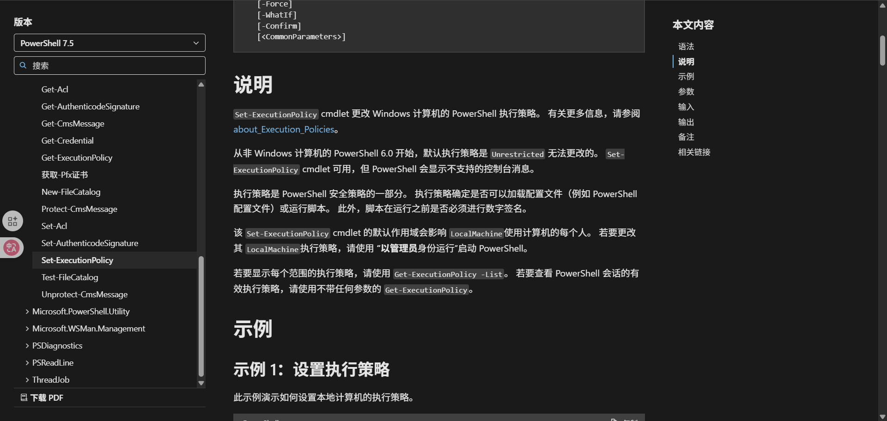

2. check

```shell
scoop --help
```

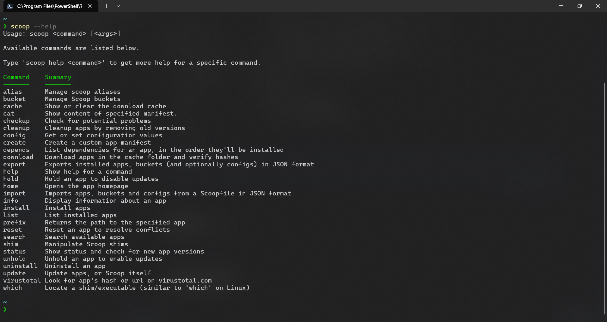

到此我们的 scoop 算是安装好了

# quickstart

umm 你干嘛 哎呦 🏀

## scoop 安装软件

scoop 主要通过 bucket 管理不同的软件(类似一个渠道，渠道下有不同的软件)，[常见的 bucket](https://scoop.sh/#/buckets)


列举几个:

- [ScoopInstaller/Java](https://scoop.sh/#/apps?q="https%3A%2F%2Fgithub.com%2FScoopInstaller%2FJava")：适用于 Oracle Java、OpenJDK、Eclipse Temurin、IBM Semeru、Zulu、ojdkbuild、Amazon Corretto、BellSoft Liberica、SapMachine 和 Microsoft JDK
- [ScoopInstaller/Main](https://scoop.sh/#/apps?q="https%3A%2F%2Fgithub.com%2FScoopInstaller%2FMain") 默认 bucket 通常存放常用软件的 LTS 版
- [ScoopInstaller/Versions](https://scoop.sh/#/apps?q="https%3A%2F%2Fgithub.com%2FScoopInstaller%2FVersions") 主要用于存放应用程序替代版本的 bucket

scoop 默认带的 bucket 是有限的，后续可以添加

```shell
scoop bucket list
scoop bucket add versions
```


scoop 安装软件

> [!TIP]
>
> 我们可以通过 https://scoop.sh/#/apps 中搜索我们需要的软件然后通过 `scoop install xxx ` 进行安装 需要注意的是在通过 scoop 安装软件的时候我们也还是需要甄别一下软件的来源(一般选择官方认证过的，更新时间较近的 较好)

scoop 安装 vsc


```shell
scoop bucket add extras
scoop install extras/vscode
```

scoop 安装 mingw


```shell
scoop bucket add main
scoop install main/mingw
```

scoop 安装 cmake

由于 mingw 并不带有 cmake(默认 make,gcc,gdb,g++) 因此我们单独安装


```shell 
scoop bucket add main
scoop install main/cmake
```

验证

- 我们可以通过 `scoop list` 查看已安装的软件

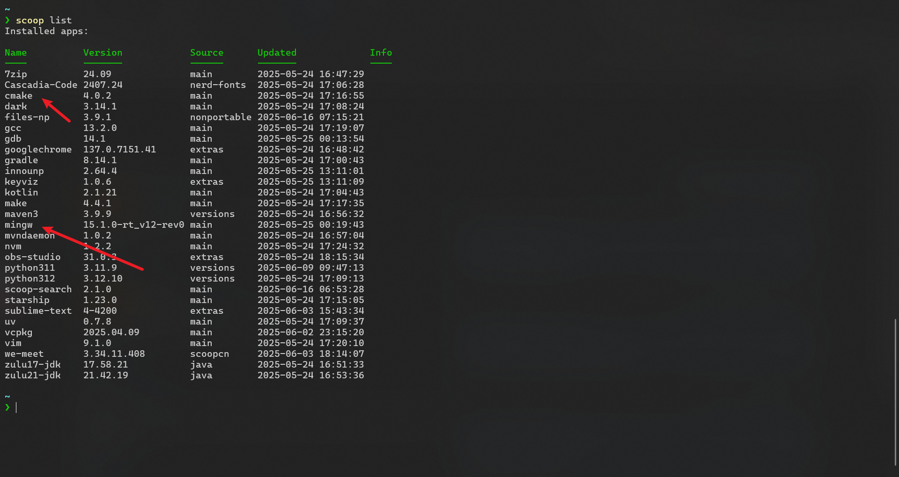

对于需要安装为命令的工具可以通过

```shell
gcc -v
gdb -v
make -v
cmake -version
```


我们还可以通过 scoop 提供的 `which` 命令查找已安装的命令

> which      Locate a shim/executable (similar to 'which' on Linux)

```shell
scoop which gcc
scoop which java
scoop which cmake
```


## scoop 多版本 sdk 切换

在上面的章节 [](#scoop 安装软件) 中我们有注意到 `which` 命令的描述中提到了 `shim/executable` 那么这个是什么意思呢


此处我们可以得知 scoop 以便携的方式下载和管理软件包，将它们整齐地隔离在 ~\scoop 中。它不会在主目录外安装文件，您可以将 Scoop 安装在任何您喜欢的地方。我们查看一下我们本机的 scoop 安装目录

```shell
cd ~/scoop
ls
```

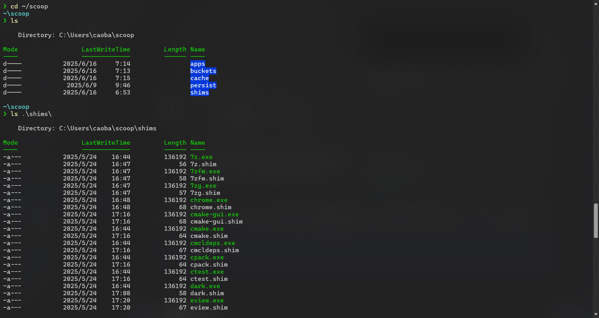

```shell
ls shims
```

可以看到里面存在很多 .exe 及其对应的 .shim ，此处我们大概可以推断出来 scoop 通过 shim 集中管理可执行程序，由此我们可以引申 scoop 另一个好用的功能—— sdk 的多版本管理，此处以 java 和 python 为例

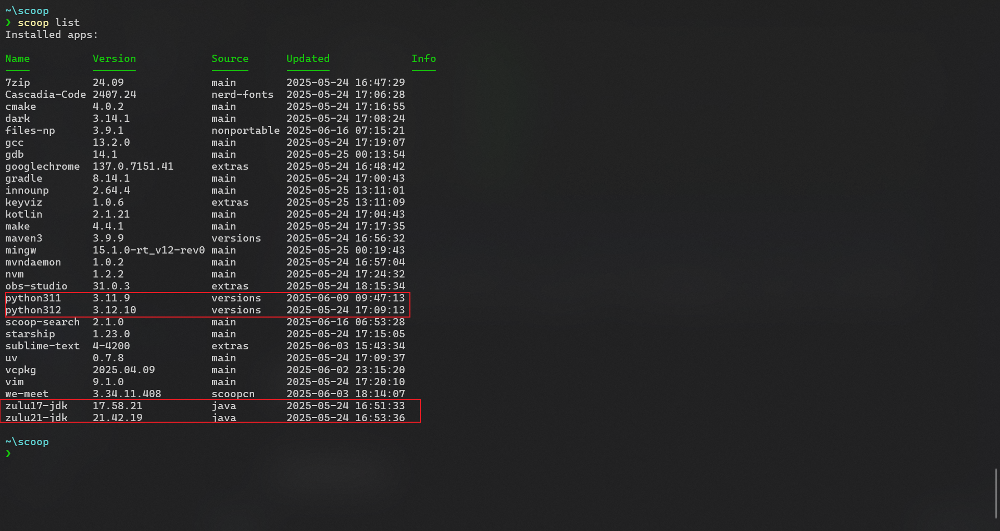

可以看到我安装了 python311、python312 以及 zulu17-jdk、zulu21-jdk

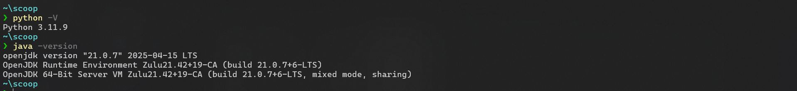

通过 `scoop reset` 我们可以进行版本的切换（ 通过上述的 shim 便于切换 path）

> reset      Reset an app to resolve conflicts

```shell
scoop reset python312
scoop reset zulu17-jdk
python -V
java -version
```


## scoop 导入导出

还有有关 export | import 的演示此处就不进行了（懒得回滚了，等下次重装电脑试试）

```shell
scoop export 
```

> export     Exports installed apps, buckets (and optionally configs) in JSON format
>
> import     Imports apps, buckets and configs from a Scoopfile in JSON format


# 配置 vsc

> [!TIP]
>
> **此部分操作内容太多，文档表现太局限，因此以视频内容为主**

通过上面的步骤我们已经安装好了 scoop 和 pwsh 并通过 scoop 安装了

- mingw(gcc,g++,gdb,make)
- visual studio code
- cmake

---

在对 vsc 进行配置前我们先对其进行简要介绍 Visual Studio Code (VS Code) 是微软开发的现代化轻量级代码编辑器其有丰富的扩展市场以及采用三级配置体系

| 配置层级         | 存储位置                | 典型用途     | 示例文件                                                |
| :--------------- | :---------------------- | :----------- | :------------------------------------------------------ |
| **工作区配置**   | 项目目录下的 `.vscode/` | 项目专属设置 | `settings.json`                                         |
| **全局用户配置** | 用户目录（跨项目生效）  | 个人开发偏好 | `~/Library/Application Support/Code/User/settings.json` |
| **默认配置**     | 编辑器内置              | 出厂预设     | -                                                       |

此处我们着重介绍下 项目中的 `.vscode` 目录. 其是 VS Code 的工作区配置中心，主要包含：

```shell
.vscode/
├── settings.json    # 编辑器设置（覆盖用户全局设置）
├── extensions.json  # 扩展推荐列表
├── tasks.json      # 自定义任务配置
└── launch.json     # 调试配置
```

了解了这些,接下来让我们开始配置 vsc 吧

## 插件安装

我们通过`.vscode/extensions.json` 的方式进行插件的安装,`extensions.json` 文件是 Visual Studio Code 的扩展推荐配置文件，主要用于：

1. **项目开发环境标准化**：为特定项目（特别是C++开发环境）推荐必要的扩展
2. **团队协作便利**：新成员克隆项目后能快速安装所需扩展
3. **功能完整性**：确保所有开发者拥有相同的工具链支持
4. **开发效率**：预置提高生产力的工具集合
5. **环境一致性**：避免因扩展差异导致的开发体验不一致

当项目被打开时，VS Code 会检测此文件并提示安装推荐的扩展。

> [!TIP]
>
> 如果需要汉化请将 ` // "MS-CEINTL.vscode-language-pack-zh-hans",` 的注释去掉

```json
{
    "recommendations": [
        // "MS-CEINTL.vscode-language-pack-zh-hans", // 中文语言包
        "atommaterial.a-file-icon-vscode",  // 文件图标主题
        // 版本控制相关
        "mhutchie.git-graph",               // 可视化 git 分支图
        "redjue.git-commit-plugin",         // git 提交信息辅助工具（含规范化提示）
        // 代码标记与笔记工具
        "wayou.vscode-todo-highlight",      // TODO 注释高亮显示
        "yzhang.markdown-all-in-one",       // Markdown 全功能支持
        // C++ 核心开发工具链
        "ms-vscode.cpptools",              // 官方 C++ 扩展（提供 IntelliSense、调试等功能）
        "ms-vscode.cmake-tools",           // CMake 集成支持
        "GitHub.copilot",                   // GitHub AI 编程助手
        // 远程开发支持
        "ms-vscode-remote.remote-ssh",      // SSH 远程开发支持
        // 代码风格与格式化
        "EditorConfig.EditorConfig",        // 多编辑器统一代码风格配置
        "LeetCode.vscode-leetcode",         // LeetCode 刷题集成
        // 快捷键方案（针对从 IDEA 转来的开发者）
        "k--kato.intellij-idea-keybindings" // IntelliJ IDEA 快捷键映射
    ]
}
```

| 扩展 ID                             | 功能描述                                            |
| :---------------------------------- | :-------------------------------------------------- |
| `shaobeichen.gradient-theme`        | 提供舒适的渐变色主题，减少视觉疲劳                  |
| `atommaterial.a-file-icon-vscode`   | 增强文件类型图标识别，支持600+文件类型              |
| `mhutchie.git-graph`                | 可视化 git 分支图谱，支持提交历史查看和分支操作     |
| `redjue.git-commit-plugin`          | 规范化 git 提交信息                                 |
| `wayou.vscode-todo-highlight`       | 高亮显示 `TODO`/`FIXME `等注释标记                  |
| `yzhang.markdown-all-in-one`        | Markdown 写作支持（目录生成、数学公式、自动补全等） |
| `ms-vscode.cpptools`                | 提供 C++ 智能感知、调试和代码导航（**必需安装**）   |
| `ms-vscode.cmake-tools`             | CMake 项目支持（配置、构建和测试）                  |
| `GitHub.copilot`                    | AI 代码补全建议（需 GitHub 账号）                   |
| `ms-vscode-remote.remote-ssh`       | 通过SSH连接远程服务器开发                           |
| `EditorConfig.EditorConfig`         | 跨编辑器代码风格统一（需配合`.editorconfig`文件）   |
| `LeetCode.vscode-leetcode`          | LeetCode 题库集成（刷题辅助工具）                   |
| `k--kato.intellij-idea-keybindings` | 为 IntelliJ IDEA 用户提供熟悉的快捷键映射           |


## 编辑器配置

`.vscode/settings.json` 是 Visual Studio Code (VS Code) 的工作区或用户级配置文件，用于自定义编辑器的行为和外观。该文件允许开发者：

1. 覆盖默认的编辑器设置
2. 为特定项目配置一致的工作环境
3. 定义文件关联和嵌套规则
4. 设置代码格式化偏好
5. 调整编辑器视觉元素（如字体、主题等）
6. 配置自动保存行为

当放在项目根目录的 `.vscode` 文件夹中时，这些设置仅适用于当前项目；当放在用户配置目录中时，则适用于所有项目。

```json
{
    // 文件自动保存设置 - 当编辑器失去焦点时自动保存
    "files.autoSave": "onFocusChange",
    // 设置默认的代码格式化工具为 EditorConfig
    "editor.defaultFormatter": "EditorConfig.EditorConfig",
    // 在保存文件时自动格式化代码
    "editor.formatOnSave": true,
    // 禁用删除文件时的确认对话框
    "explorer.confirmDelete": false,
    // 编辑器字体设置
    "editor.fontFamily": "Cascadia Mono", // 使用 Cascadia Mono 字体
    "editor.fontSize": 12.6,             // 字体大小设为12.6
    "editor.fontWeight": "normal",       // 字体粗细为正常
    // 窗口缩放级别
    "window.zoomLevel": 1.5,
    // 光标设置
    "editor.cursorStyle": "line",        // 光标样式为线型
    "editor.cursorBlinking": "expand",   // 光标闪烁效果为扩展动画
    "editor.cursorWidth": 1,             // 光标宽度为1像素
    "editor.cursorSmoothCaretAnimation": "on", // 启用平滑的光标动画
    // Markdown预览字体大小
    "markdown.preview.fontSize": 11,
    // 工作区主题设置
    "workbench.colorTheme": "One Monokai",      // 使用 One Monokai 颜色主题
    "workbench.iconTheme": "a-file-icon-vscode", // 使用 a-file-icon-vscode 图标主题
    // Git提交插件设置 - 限制主题行最多30个字符
    "GitCommitPlugin.MaxSubjectCharacters": 30,
    // 启用文件嵌套功能（将相关文件分组显示）
    "explorer.fileNesting.enabled": true
}
```

## 配置 C/C++ Extension Pack

video

## CMakeLists.txt

```shell
cmake_minimum_required(VERSION 3.26)
project(hello_visual_studio_code_cpp C CXX)

# --------------------------< 使用须知 >------------------------------------
# 本文件是一个自动化的 CMakeList，有以下功能：
# - 自动遍历 src 目录下的所有 .c 和 .cpp 文件，并将其编译为可执行文件。
# - 将可执行文件(即编译结果)输出到项目根目录下的 .runtime/ 目录中。
# - 将库文件输出到项目根目录下的 .library/ 目录中。
# - 将中间文件输出到项目根目录下的 .archive/ 目录中。
# >-----------------------------------------------------------------------
# 使用此 CMakeList 时，若要新建 C/C++ 语言文件，请按照以下步骤：
# 1. 右键 src 目录(如果没有 src 目录，请先创建)——新建——C/C++源文件
# 2. 在弹出的对话框中，输入文件名(仅允许英文小写及下划线，不要出现空格)，
#    后缀为 ".c(C语言文件)"或".cpp(C++文件)"，切记不要勾选“添加到目标”，点击确定。
# 3. 点击 左上角横线——文件——重新加载 CMake 项目 。
# 注：未重载前，进入文件可能会有“不属于任何项目目标”的警告，重载后即会消失。
#    若此警告未消失，请检查文件是否在 src 目录下，以及文件名是否符合规范。
# >-----------------------------------------------------------------------
# 使用此CMakeList  时，若运行 main() 函数代码，请直接点击函数前的绿色三角形按钮。
# 右上角的运行按钮会自动运行最近一次运行的程序，因此可能不是你想要的结果。
# ------------------------------------------------------------------------

# 按照书本要求设定C语言和C++版本
set(CMAKE_C_STANDARD 99)
set(CMAKE_CXX_STANDARD 20)

# 设定构建运行路径，避免污染根目录
set(CMAKE_ARCHIVE_OUTPUT_DIRECTORY ${PROJECT_SOURCE_DIR}/.archive)
set(CMAKE_LIBRARY_OUTPUT_DIRECTORY ${PROJECT_SOURCE_DIR}/.library)
set(CMAKE_RUNTIME_OUTPUT_DIRECTORY ${PROJECT_SOURCE_DIR}/.runtime)
set(EXECUTABLE_OUTPUT_PATH ${PROJECT_SOURCE_DIR}/.runtime)
set(LIBRARY_OUTPUT_PATH ${PROJECT_SOURCE_DIR}/.library)

include_directories(${PROJECT_SOURCE_DIR}/src)

# 遍历项目src目录下所有的 .c 文件，自动添加
file(GLOB_RECURSE files src/*.c src/*.cpp)
foreach (file ${files}) # 遍历所有发现的文件
    get_filename_component(name ${file} NAME) # 获取文件名
    add_executable(${name} ${file}) # 添加可执行文件
endforeach () # 遍历结束
```

## Hello CPP

video

## Hello CMake

video

## 大体目录结构


```shell
hello-visual-studio-code-cpp/
├── 配置文件
│   ├── .editorconfig    # 跨编辑器代码风格配置
│   ├── .gitignore       # git 版本控制忽略规则
│   └── CMakeLists.txt   # CMake 构建系统配置文件（核心构建逻辑）
├── 文档
│   ├── INSTALL.md       # 项目安装说明
│   └── README.md        # 项目概览文档
├── 构建输出目录
│   ├── .archive/        # 中间文件（由 CMake 自动生成）
│   ├── .library/        # 库文件输出目录（由 CMake 自动生成）
│   └── .runtime/        # 可执行文件输出目录
├── VS Code 配置
│   └── .vscode/         # 工作区专属配置
│       ├── extensions.json # 推荐扩展列表
│       └── settings.json   # 编辑器设置
├── 静态资源
│   └── assets/          # 图片/字体等资源文件
├── 头文件
│   └── include/         # 公共头文件目录
│       └── hello_cpp.h  # 示例头文件
└── 源代码
    └── src/             # 主源代码目录
        ├── demo01_hello_world.cpp
        ├── demo02_hello_cmake.cpp 
        └── demo03_hello_cxk.cpp
```

# LeetCode 集成

**感觉不太好用**

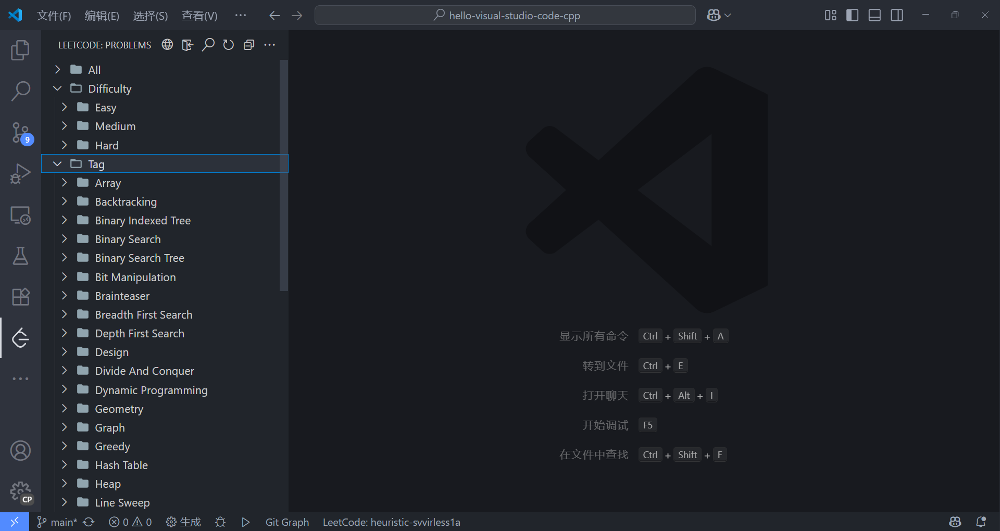

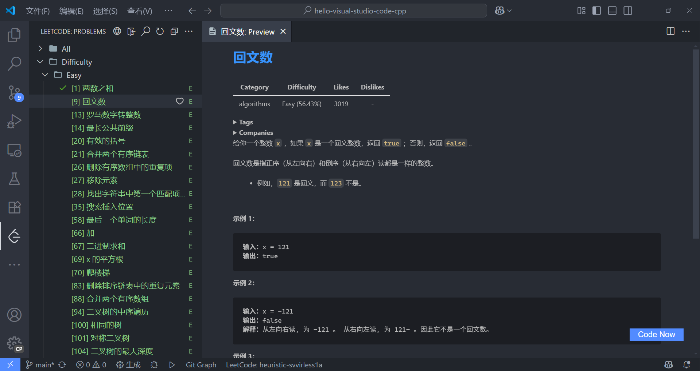

# 云开发

TODO

## github

TODO

## devbox

TODO


# ref

- [How To](../HOW-TO.md)